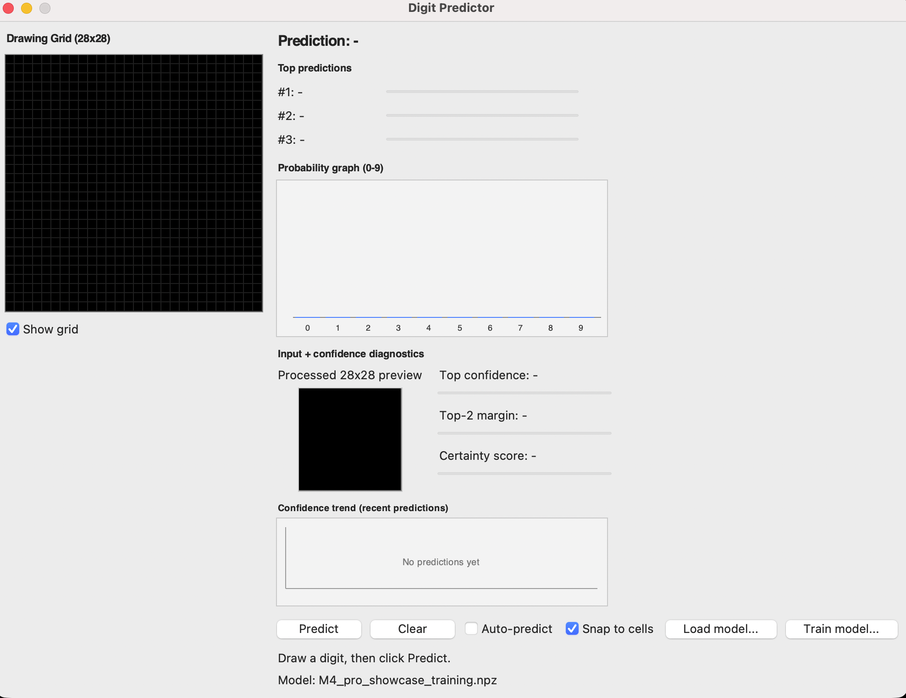
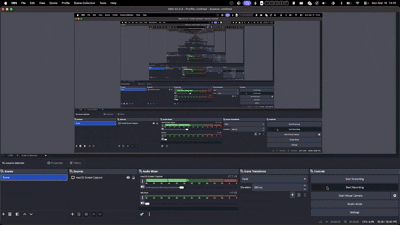

# Neuronales Netz

Dieses Projekt ist ein NumPy-Neuronales-Netz, das handgeschriebene Ziffern (MNIST) erkennt.  
Außerdem gibt es eine Tkinter-App, in der Sie eine Ziffer zeichnen und die Vorhersage live sehen koennen.

## Einrichtung

Installieren Sie die benoetigten Pakete:

```bash
pip install -r requirements.txt
```

## App starten

```bash
python app.py --app
```

Wenn kein Modell geladen ist, fragt die App nach einer `.npz`-Modelldatei.

## Modellergebnisse

Die Modelldateien liegen in `models/`.

| Modell | Trainiert auf Datensatz | Train acc | Val acc | Test acc | Kurze Notiz |
| --- | --- | --- | --- | --- | --- |
| `models/kaggle_mnist_full.npz` | `data/kaggle_mnist/mnist_png` (60k Train / 10k Test) | 0.9737 | 0.9697 | 0.9743 | Bestes Gesamtmodell. Sehr gute Standardwahl. |
| `models/M4_pro_showcase_training.npz` | `data/kaggle_mnist/mnist_png` (gleicher Split/gleiche Einstellungen) | 0.9729 | 0.9722 | 0.9725 | Sehr nah am besten Modell. Im Showcase-Bild genutzt. |
| `models/initial_model.npz` | Aelterer Reduced-MNIST-Workflow (im Stil von `data/Reduced_MNIST_Data`) | - | - | - | Aelteres Basis-Modell. Keine Metrics-Datei enthalten. |

Zusatzinfos aus den Metrics-Dateien:
- Netzwerkstruktur: `784 -> 256 -> 128 -> 64 -> 10`
- Tiefe: 4 Schichten
- Parameter: ca. 242,762
- Geschaetzte Datensatz-Obergrenze: ca. 0.98
- Datenaugmentation: aktiviert

## So funktioniert das Training

Der Trainingscode liegt in `train.py` und wird ueber `app.py`/`main.py` gestartet.

Hauptschritte:
- Mini-Batch-Training
- Cross-Entropy-Loss + L2-Weight-Decay
- Validierungs-Split + Early Stopping
- schrittweiser Learning-Rate-Abfall
- Datenaugmentation (kleine Verschiebungen, Helligkeit/Strichstaerke, leichtes Verdicken, Rauschen)
- speichert Train/Val/Test-Metriken in jeder Epoche

Beispiel fuer einen Trainingsbefehl:

```bash
python app.py --train --epochs 80 --batch-size 64 --learning-rate 0.005 --hidden-dims 256,128,64 --weight-decay 1e-4 --lr-decay-step 20 --lr-decay-factor 0.5 --patience 12 --model-path models/M4_pro_showcase_training.npz
```

## Was die App anzeigt

Wenn Sie `python app.py --app` starten, sehen Sie:
- 28x28-Zeichenfeld
- beste Vorhersage + Top-3-Vorhersagen
- Wahrscheinlichkeitsdiagramm fuer die Ziffern 0 bis 9
- verarbeitete 28x28-Vorschau des Inputs
- Konfidenzwerte (Top-Score, Abstand Top-1 zu Top-2, Certainty-Score)
- Konfidenzverlauf aus den letzten Vorhersagen
- Buttons zum Laden eines Modells und zum Trainieren direkt in der App
- zusaetzliche Trainings-Dashboards, falls eine `.metrics.npz` vorhanden ist

## App-Showcase



## Demos

Training-Demo:


Modellnutzung-Demo:


