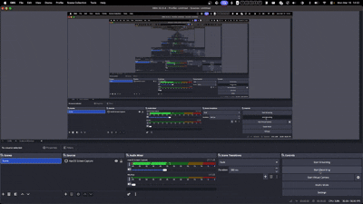

# Neuronales Netz

Simple NumPy-based feed-forward neural network for reduced MNIST digit classification.

*Test change added so you can see a diff.*

## Setup

```bash
pip install -r requirements.txt
```

## Run Training in

```bash
python main.py (option flags etc..) 
```

The script loads data from `data/Reduced_MNIST_Data`, trains a model with architecture
`784 -> 128 -> 64 -> 10`, and prints epoch-wise loss and accuracy.

Current default training uses:
- larger architecture: `784 -> 256 -> 128 -> 64 -> 10`
- on-the-fly data augmentation (shift, intensity variation, mild thickening, noise)
- validation split + early stopping
- learning-rate decay
- L2 weight decay

### Best model to date
`models/kaggle_mnist_full.npz was trained on the full Kaggle MNIST split (60k train + 10k test) with the PNG-aware loader that normalizes, flattens, and shuffles each image. It ran 75 epochs with stepped learning rates (0.005 → 0.0025 → 0.00125 → 0.00063), topped out at val acc ≈ 0.9705 (epoch 57), and achieves ~0.9736 on the official test set. Inference on that dataset produces ~0.9736 accuracy by default. The original `models/initial_model.npz` (previously `model.npz`) still ships with the repo as a baseline checkpoint if you need to compare performance.

## Command-line flags

> The `docs/project-report.md` file captures the datasets, experiments, results, grading notes, and reproduction steps (run `make install && make train-kaggle`).

## Automation

The repository now ships with a `Makefile` covering the core tasks:

## Model catalogue

`docs/models.md` now outlines every checkpoint under `models/`, including the datasets, validation/test accuracy, and where to find the metrics archives. Use this doc for quick references when choosing which checkpoint to load in training, inference, or the Tkinter app.


```bash
make install      # set up virtualenv & install deps
make train-kaggle # rebuild the best Kaggle MNIST model
make test-loader  # run a quick shape check on the loader
```

`tests/test_loader.py` verifies the flattening + one-hot encoding pipeline.

## Training Demo Video

Training demo preview:

<div align="center">
  
</div>

Model usage preview:

<div align="center">
  
</div>

For the full recording, use:

- [Open training demo video](<./2026-03-16 14-13-42.mov>)

### Best model to date
Run `python main.py` with the flags below to control its behavior:

- `--train` (default) runs training on the reduced MNIST split and saves the model to `model.npz` unless you override `--model-path`.
- `--app` opens the Tkinter drawing app. Use it together with `--model-path` if you already trained a model.
- `--train-data-path` / `--test-data-path` let you pick arbitrary folders that mirror the `Reduced_Trainging_data` / `Reduced_Testing_data` layout, including the Kaggle `mnist_png` tree (PNG inputs are now averaged to grayscale and normalized if needed), so you can experiment with different splits before launching training.
- `--epochs`, `--batch-size`, `--learning-rate`, `--weight-decay`, `--val-split`, `--hidden-dims` and the learning-rate decay/patience flags let you tweak the training loop.
- `--no-augment` disables the built-in augmentation pipeline, which is on by default.
- `--debug-app` prints extra startup logs when the applet loads, helpful if Tkinter is missing or failing.

## Save Model + Launch Drawing Applet

Train and save a model:

```bash
python main.py --train --model-path model.npz
```

High-quality training example:

```bash
python main.py --train --epochs 80 --hidden-dims 256,128,64 --learning-rate 0.005 --lr-decay-step 20 --lr-decay-factor 0.5 --patience 12 --weight-decay 1e-4 --model-path model.npz
```

Launch the real-time Tkinter drawing app:

```bash
python main.py --app --model-path model.npz
```

Train and open the applet in one command:

```bash
python main.py --train --app --model-path model.npz
```
