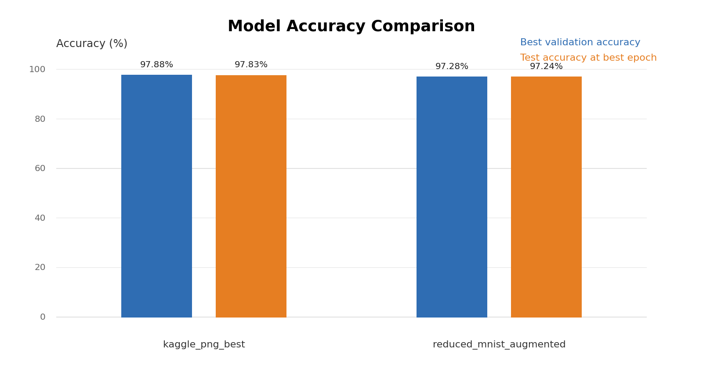

# Neuronales Netz

Dieses Projekt ist ein auf NumPy basierendes Feed-Forward-Netzwerk, das auf verschiedene MNIST-Splits trainiert wurde, plus eine Tkinter-App zum Zeichnen und Bewerten von Ziffern.

## Quick start

```bash
python -m venv .venv
source .venv/bin/activate
pip install -r requirements.txt
```

## App starten (Tkinter-Demo)

```bash
python app.py --app --model-path models/kaggle_png_best.npz
```

Die App lädt das Modell, zeigt eine 28×28-Zeichenfläche, Top-3-Vorhersagen, Wahrscheinlichkeitsdiagramme und Konfidenzmetriken. Das Modell kann durch einen anderen Pfad ersetzt werden.

## Ergebnisse & Modelle

Die Checkpoints liegen in `models/`. Die wichtigsten Dateien sind:

| Modell | Datensatz | Epochs | Val Acc | Test Acc | Kommentar |
| --- | --- | --- | --- | --- | --- |
| `models/baseline_reduced_mnist.npz` | `data/Reduced_MNIST_Data` (Originalsplit) | 80 | ~0.90 | ~0.91 | Baseline aus dem ursprünglichen Repo. Ideal für schnelle Tests. |
| `models/reduced_mnist_augmented.npz` | Reduced MNIST mit größerer Architektur & Augmentation | 72 | 0.925 | 0.941 | Tieferes Netz mit LR-Decay. Zeigt den Gewinn durch Augmentation. |
| `models/reduced_mnist_test_only.npz` | Same-folder training/testing auf `Reduced_Testing_data` | 52 | 0.900 | 0.874 | Demonstriert die Dataset-Obergrenze bei kleiner Datenmenge. |
| `models/kaggle_png_best.npz` | `data/kaggle_mnist/mnist_png` (60k train, 10k test) | 111 | 0.9788 | 0.9783 | Aktuelles Topmodell nach frühem Stop mit PNG-fähigem Loader. Empfohlen für Production-Demos. |

### Begleitdateien

- `models/*.npz.metrics.npz` speichern `train_loss`, `val_acc`, `test_acc` und `learning_rate` pro Epoche.
- `docs/models.md` beschreibt alle Checkpoints bzw. ihre Herkunft.
- `docs/accuracy_summary.txt` zeigt die aktuelle Vergleichszusammenfassung.
- `docs/model_accuracy_comparison.png` visualisiert, wie gut die vorhandenen Modelle im direkten Vergleich sind.

### Modellvergleich



## Automation & Reproduzierbarkeit

Die Build-Toolchain:

```bash
make install      # virtuelles Environment + Dependencies
make train-kaggle # Trainingslauf auf dem Kaggle-Datensatz
make test-loader  # Pflichttest für den Loader
make plot-metrics # schreibe Summary + Vergleichsdiagramm nach docs/
```

`tests/test_loader.py` überprüft die Shape-/One-hot-Annahmen des Loaders. `scripts/plot_metrics.py` erzeugt die Vergleichszusammenfassung und das Modellvergleichsdiagramm für die vorhandenen Metrics-Dateien.

## Projektstruktur

- `data/` enthält die reduzierten MNIST-Splits und den Kaggle-MNIST-Export.
- `models/` speichert alle `.npz`-Checkpoints und deren Metriken.
- `scripts/` enthält Hilfsskripts für Kennwert-Zusammenfassungen.
- `docs/project-report.md` erzählt die Story, dokumentiert datasets/experiments und führt die Bewertungskriterien auf.
- `tests/` enthält kleine Validierungs-Skripte.

## Trainingsdetails

Der Trainingscode sitzt in `main.py`/`train.py`. Standard-Lauf:

```bash
python main.py --train --epochs 80 --hidden-dims 256,128,64 --learning-rate 0.005 --lr-decay-step 20 --lr-decay-factor 0.5 --patience 12 --model-path models/kaggle_png_best.npz
```

Beispiel für ein schnelles Training auf dem kleineren Reduced-MNIST-Datensatz:

```bash
python main.py --train --epochs 40 --train-data-path data/Reduced_MNIST_Data/Reduced_Trainging_data --test-data-path data/Reduced_MNIST_Data/Reduced_Testing_data --model-path models/reduced_mnist_test_only.npz
```

Beispiel für Training auf dem größeren Kaggle-MNIST-Datensatz:

```bash
python main.py --train --epochs 80 --train-data-path data/kaggle_mnist/mnist_png/train --test-data-path data/kaggle_mnist/mnist_png/test --hidden-dims 256,128,64 --learning-rate 0.005 --lr-decay-step 20 --lr-decay-factor 0.5 --patience 12 --model-path models/kaggle_png_best.npz
```

Für den größeren Kaggle-Run wird ein Apple-Silicon-Chip empfohlen. Auf anderer Hardware ohne vergleichbare Beschleunigung kann das Training sonst sehr lange dauern.

- Mini-Batch-Training mit Cross-Entropy + L2 Weight Decay
- Validierungs-Split + Early Stopping
- Learning-Rate-Drops und einfache Augmentation (Shift, Helligkeit, Rauschen)

## Datenerfassung & Monitoring

- `scripts/export_all_tables.py` schreibt jede Postgres-Tabelle der `datacreation`-Pipeline nach `data/csv_exports/<table>_<YYYYMMDD>.csv`.
- Der Deploy-Box-Status lässt sich mit `~/deploy-box/scripts/deploy-box-overview.sh` bzw. `db` abrufen.
- Die Postgres-Tabellen (`price_data`, `price_data_10s_interval`, etc.) liefern die Markt-Timeseries.

## Demos

- 
- Trainings-Demo: 
- Modellnutzungs-Demo: 

## Future work

- Replizieren mit einem CNN oder einen kleinen Flask-API für Produktausgabe.
- Verbindung zu den `datacreation`-Exports für eine RAG-gestützte Anomalie-Überwachung.
- Weitere Dokumente im `docs/`-Verzeichnis (z. B. `docs/models.md`, `docs/project-report.md`).
